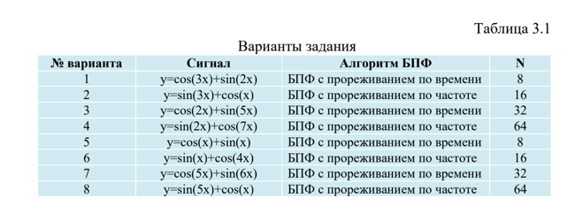
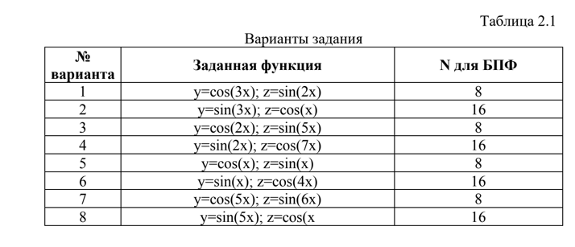

# Лабораторные работы по ЦОСиИ

Данный репозиторий содержит лабораторные работы по курсу "Цифровая обработка сигналов и изображений" (ЦОСиИ).

## Бригада Ходосевич-Семков

### Лабораторная работа 1: Преобразование Фурье

- **Вариант 3:**

### Лабораторная работа 2: Операции свертки и корреляции

- **Вариант 6:**

